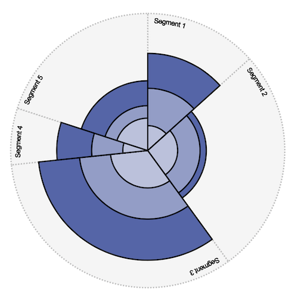

# d3-drag-pie

## Introduction
This JavaScript library creates a pie chart with multiple segments, each containing multiple categories.

The chart supports segment and category dragging which calls accessor functions to update
the underlying data values.

Interaction with the pie chart can be hooked into, so your application can respond to certain chart interactions and events.



## Dependencies
Requires D3.js library from https://d3js.org
Client browser requires SVG support.

## Basic usage
The `d3dp` function returns an object with a `create` function into which you pass a `config` object - see "Config object" section.

```
<script src="https://d3js.org/d3.v5.min.js"></script>
<script src="./js/d3-drag-pie.js"></script>
<script>
    var config = { ... };
    d3dp().create(config);
</script>
```

## `config` object
When creating a new chart, you must specify a configuration object. This provides
essential information about the chart so that it can be created.

- `target` DOM object into which SVG chart will be rendered.
- `data` Reference to the chart data object - see "Data object" section.
- `size` Dimension in pixels of the chart square (optional, default 500).
- `cornerRadius` Radius effect on segments (optional, default 0).
- `categoryColors` Array of colors to use for segments (optional, three defaults provided).
- `segmentsDraggable` When true, segments are draggable (optional, default false).
- `categoriesDraggable` When true, categories are draggable (optional, default false).
- `segmentMinimum` Minimum allowed value of any segment when dragged (optional).
- `segmentMaximum` Maximum allowed value of any segment when dragged (optional).
- `categoryMinimum` Minimum allowed value of any category when dragged (optional).
- `categoryMaximum` Maximum allowed value of any category when dragged (optional).
- `categoryScaleMaximum` Maximum value to use for scaling display of categories (optional).
- `categoryStacking` Stack categories rather than overlapping (optional, default false).
- `showSegmentLabels` Show segment name labels (optional, default false).
- `integerValueStepping` Prevent dragging from creating fractional values.
- `accessors` Object containing getter and setter functions for data values - see "Accessors" section (optional).
- `events` Object containing custom functions to respond externally to certain chart interactions - see "Event hooks" section (optional).

## Data object
The data object is an array of segment objects. Each segment object has a name, value and array of categories. Each category object has a name and value.

```
var data = [
        {
            name: "Segment 1",
            value: 20,
            categories: [
                { name: "Category 1", value: 10 },
                { name: "Category 2", value: 30 }
            ]
        },
        {
            name: "Segment 2",
            value: 40,
            categories: [
                { name: "Category 1", value: 30 },
                { name: "Category 2", value: 20 }
            ]
        },
        {
            name: "Segment 3",
            value: 50,
            categories: [
                { name: "Category 1", value: 30 },
                { name: "Category 2", value: 25 }
            ]
        }
    ];
```

## Accessors
A series of accessor functions are used to provide getter and setter functionality onto
the data. This allows custom implementations to decide how data is manipulated. Accessors are defined in the `accessors` object of the config.

```
{
    accessors: {
        getSegmentValue: function(segment) { },
        setSegmentValue: function(segment, value) { },
        getCategoryValue: function(category) { },
        setCategoryValue: function(category, value, segment) { },
        getSegmentName: function(segment) { },
        getCategoryName: function(category) { }
    }
}
```

When accessors are not provided a default implementation is used; for more information about each of these see the function definitions below.

### getSegmentValue(segment)
Return the value of a segment. Default implementation returns `segment.value`.

Arguments:
- `segment` Segment for which value is required.

### setSegmentValue(segment, value)
Set the value of a segment. Default implementation sets `segment.value`.

Arguments:
- `segment` Segment on which value is to be set.
- `value` Numeric value to set.

### getCategoryValue(category)
Return the value of a category. Default implementation returns `category.value`.

Arguments:
- `category` Category for which value is required.

### setCategoryValue(category, value, segment)
Set the value of a category. Default implementation sets `category.value`.

Arguments:
- `category` Category on which value is to be set.
- `value` Numeric value to set.
- `segment` Reference to the parent segment containing `category`.

### getSegmentName(segment)
Return the name of a segment. Default implementation returns `segment.name`.

Arguments:
- `segment` Segment for which name is required.

### getCategoryName(category)
Return the name of a category. Default implementation returns `category.name`.

Arguments:
- `category` Category for which name is required.

## Event hooks
Events are defined in the `config` object: 
```
{
    events: {
        startRedraw: function(obj, data) { },
        endRedraw: function(obj, data, chart) { },
        segment: {
            mouseover: function(segment) { },
            mouseout: function(segment) { },
            click: function(segment) { },
            drag: function(segment) { }
        },
        category: {
            mouseover: function(category, segment) { },
            mouseout: function(category, segment) { },
            click: function(category, segment) { },
            drag: function(category, segment) { }
        }
    }
}
```
### startRedraw(data)
Called whenever the pie chart is redrawn, before chart is updated.
This may be triggered for example by dragging a segment or
category, or by the `redraw` function being called externally.

Arguments:
- `data` Reference to the data object being redrawn.

### endRedraw(data, chart)
Called whenever the pie chart is redrawn, once the redraw is complete.
This may be triggered for example by dragging a segment or
category, or by the `redraw` function being called externally.

Arguments:
- `data` Reference to the data object being redrawn.
- `chart` Reference to the SVG chart object.

### mouseover(segment)
Called when mouse is hovering over a segment. Define within `events.segment` object.

Arguments:
- `segment` Reference to the segment.

### mouseout(segment)
Called when mouse leaves a segment. Define within `events.segment` object.

Arguments:
- `segment` Reference to the segment.

### click(segment)
Called when a segment is clicked. Define within `events.segment` object.

Arguments:
- `segment` Reference to the segment.

### drag(segment)
Called when a segment is dragged. Dragging is handled by the chart,
but this may be useful when you need to update other interface components
as a result of changes to the underlying data triggered by the dragging action.
Define within `events.segment` object.

Arguments:
- `segment` Reference to the segment.

### mouseover(category, segment)
Called when mouse is hovering over a segment. Define within `events.category` object.

Arguments:
- `category` Reference to the category.
- `segment` Reference to the segment.

### mouseout(category, segment)
Called when mouse leaves a segment. Define within `events.category` object.

Arguments:
- `category` Reference to the category.
- `segment` Reference to the segment.

### click(category, segment)
Called when a segment is clicked. Define within `events.category` object.

Arguments:
- `category` Reference to the category.
- `segment` Reference to the segment.

### drag(category, segment)
Called when a segment is dragged. Dragging is handled by the chart,
but this may be useful when you need to update other interface components
as a result of changes to the underlying data triggered by the dragging action.
Define within `events.category` object.

Arguments:
- `category` Reference to the category.
- `segment` Reference to the segment.

## CSS classes
The chart segments and categories are created with some pre-defined CSS classes attached.

CSS classes:
- `d3dp-segment` Class of segment SVG path.
- `d3dp-segment-text-label` Class of text label of segment.
- `d3dp-segment-category` Class of category SVG path.
- `d3dp-segment-category<c>` Class of specific category, where `<c>` is the index in category data array.

## SVG object IDs
The chart segments and categories are created with some pre-fefined `id` attributes.

Id attributes:
- `d3dp-segment<s>` Attached to each segment on the SVG chart, where `<s>` is the index in data array.
- `d3dp-segment<s>-category<c>` Attached to each category on the SVG chart, where `<s>` and`<c>` are the index of the segment and category in the data array respectively.